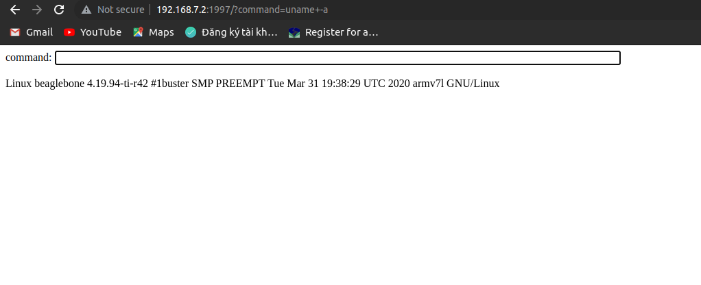
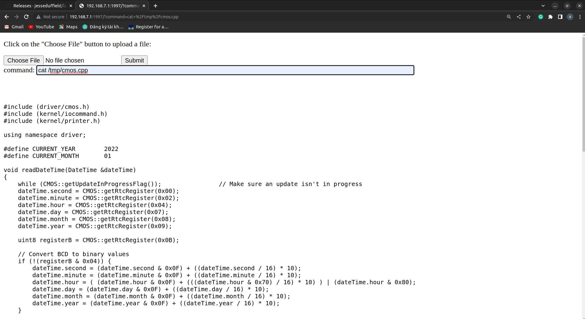

# shellcrosshttp





supported shell scripting over HTTP, upload files
you can use any supported command on host over HTTP  
example : `ls` `cp`, ...  
Topology

target <==ethernet/wifi==> host

+ step 1  
attach this binary to the target and run it.  
+ step 2   
from host open  <target ip>:1997 on your browser. For testing you also can run directly the binary on host and open http://localhost:1997

# Build & run
* build one binary without any library dependencies (pthread) -> make output binary is big (~6.3MB)  
* use `CGO_ENABLED=0 go build `
to build if the target have below dependencies 
```
linux-vdso.so.1 (0x00007fffb48fe000)
libpthread.so.0 => /lib/x86_64-linux-gnu/libpthread.so.0 (0x00007f66a4bec000)
libc.so.6 => /lib/x86_64-linux-gnu/libc.so.6 (0x00007f66a49c4000)
/lib64/ld-linux-x86-64.so.2 (0x00007f66a4c0b000)

```
# Test 
* run normal `go run main.go`
* run with debug infomation `go run main.go -debug`

# Note  
* default port is *1997*

* Currently this software support Chrome properly.

* Don't try to use keep session shell commands like `top`, `ping`. it won't show the result.

* Can't use pipeline command like `ps | grep abc`. It doesn't work  


